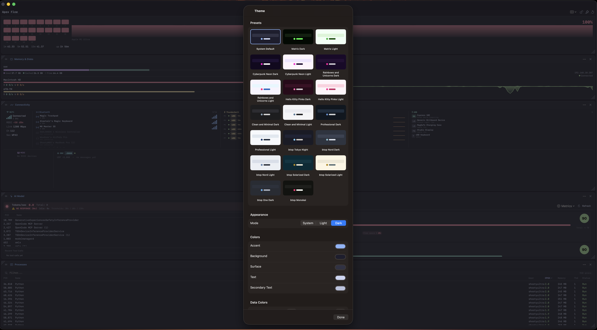
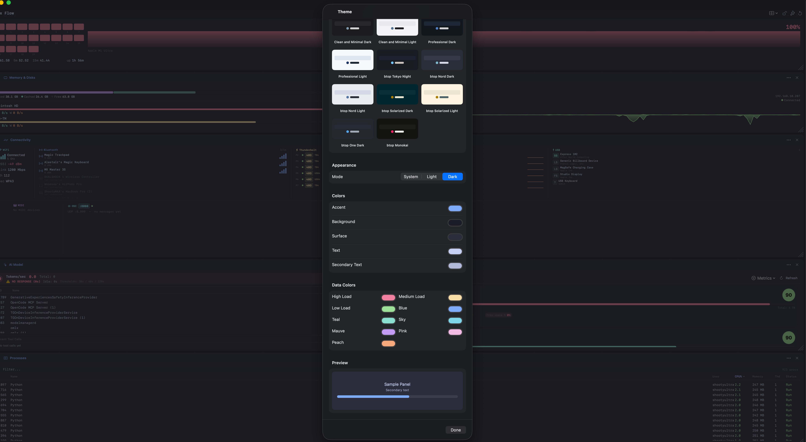

# Apex Flow

[](https://github.com/WOODSEE-DIGI/ApexFlow/actions/workflows/build.yml)
[](https://swift.org)
[](https://www.apple.com/macos/)
[](LICENSE)

**A native macOS system monitor built in Swift 6 / SwiftUI.**

Apex Flow is a full-featured, open-source replacement for btop, designed specifically for macOS with native access to Apple frameworks. It monitors CPU, memory, disks, network, processes, storage health, AI model activity, and — uniquely — provides real-time visibility into Thunderbolt ports, USB peripherals, Bluetooth devices, MIDI hardware, and OSC network streams.

Panels live on a draggable, resizable canvas and the entire colour scheme can be customised with built-in presets or your own palette.

---

## Screenshots

| Main dashboard | Panel picker |
|---|---|
|  |  |

| Theme presets | Theme customisation |
|---|---|
|  |  |

---

## Features

### Canvas Workspace
- **Draggable, resizable panels** — Arrange CPU, Memory & Disks, Network, Connectivity, AI Model, Processes, and Storage Health however you like
- **Persistent layout** — Panel positions, sizes and visibility are saved between launches
- **Lock / unlock** — Toggle editing mode to prevent accidental moves
- **Panel picker** — Show or hide any panel from the toolbar
- **Native hidden-title-bar window** — Clean, compact macOS chrome

### Themes & Appearance
- **20 built-in presets** — Matrix Dark/Light, Cyberpunk Neon Dark/Light, Hello Kitty Pinks Dark/Light, Rainbows and Unicorns Dark/Light, Clean and Minimal Dark/Light, Professional Dark/Light, btop Tokyo Night, Nord Dark/Light, Solarized Dark/Light, One Dark, Monokai
- **Custom colours** — Override accent, background, surface, text, and secondary text
- **Data colours** — Adjust load indicators (high / medium / low) and semantic palette colours (blue, teal, sky, mauve, pink, peach)
- **Light / dark / system appearance** — Each preset can pin a mode or follow the system
- **Reset to defaults** — One click returns to the built-in Catppuccin/Mocha palette

### System Monitoring
- **CPU** — Per-core usage grid with animated 60-second history chart, 1/5/15-minute load averages, uptime, CPU name, and temperature when available
- **Memory & Disks** — Stacked RAM usage bar (used / cached / free / swap), live disk read/write sparklines, and a scrollable drive list
- **Network** — Per-interface mirrored area charts for download/upload, live rate readout, and a compact interface picker filtered to real adapters
- **Processes** — Sortable, filterable process list with PID, CPU%, memory, threads and status. Right-click to send SIGTERM or SIGKILL via the privileged helper bridge
- **Storage Health** — S.M.A.R.T. status, health score badge, temperature, power-on hours, power cycles, load cycles, reallocated/pending/offline-uncorrectable sectors, wear level, filesystem verification, FileVault/encryption status, Time Machine backup age, bus protocol, and SSD vs HDD. Toggle which metrics appear for each drive
- **AI Model Monitor** — Real-time monitoring of SwiftMaestro / LM Studio token telemetry (tokens/sec, streaming/processing/idle state, silent-period detection), a list of active AI processes with friendly-name mapping, and recent MCP tool calls

### Connectivity Panel
- **WiFi** — SSID, signal bars, RSSI (dBm), link rate, channel, band (2.4 / 5 / 6 GHz), and security
- **Bluetooth** — Connected devices with type icons and RSSI signal bars
- **Thunderbolt** — All ports enumerated via `system_profiler`, showing negotiated link speed (≤40G / 40G), protocol mode (TB3 / TB4 / USB4), connected device name, and live per-port I/O activity sparklines
- **USB** — Full device list via `IOUSBHostDevice`, with speed-coded badges (USB4 / SS+ / SS / HS / FS / LS), vendor names, and live per-device throughput sparklines for USB mass-storage devices
- **MIDI** — Live CoreMIDI monitoring with a 16-channel activity grid per device and decoded message display (Note On/Off, CC, Program Change, Pitchbend)
- **OSC** — Open Sound Control listener on UDP port 8000, with a real-time decoded message log

### Architecture & Engineering
- **Swift 6 strict concurrency** — `async/await`, actors, and `@MainActor` observables throughout
- **Collector pattern** — Each sensor runs in its own actor off the main thread; models are `@MainActor @Observable`
- **Privileged helper daemon** — `ApexFlowHelper` registered via `SMAppService` so process termination can run with elevated privileges
- **xcodegen project management** — `project.yml` drives `ApexFlow.xcodeproj`; regenerate after structural changes
- **GitHub Actions CI** — Automated build workflow on every push

---

## Requirements

| Requirement | Version |
|---|---|
| macOS | 14.0 Sonoma or later |
| Xcode | 16.0 or later |
| Swift | 6.0 |

---

## Install

### Homebrew (recommended)

```bash
brew tap WOODSEE-DIGI/tap
brew install --cask apex-flow
```

Because the app is ad-hoc signed, macOS Gatekeeper will quarantine it on first launch. Either right-click the app and choose **Open**, or remove the quarantine attribute:

```bash
xattr -dr com.apple.quarantine /Applications/ApexFlow.app
```

### Build from Source

```bash
# Clone
git clone https://github.com/WOODSEE-DIGI/ApexFlow.git
cd ApexFlow

# Install xcodegen (if not already installed)
brew install xcodegen

# Generate the Xcode project
xcodegen generate

# Open in Xcode and run (⌘R)
open ApexFlow.xcodeproj
```

The project is managed with [xcodegen](https://github.com/yonaskolb/XcodeGen) from `project.yml`. `ApexFlow.xcodeproj` is regenerated after any structural change.

### First Run Permissions

On first launch, macOS will prompt for:
- **Bluetooth** — to display connected BT devices and RSSI
- **Location** — required by macOS to read the WiFi network name (SSID) via CoreWLAN

---

## Architecture

Apex Flow uses Swift 6 strict concurrency throughout.

```
Apex/
├── App/
│   ├── ApexApp.swift                # @main entry point, WindowGroup
│   ├── ContentView.swift            # Toolbar + canvas workspace host
│   ├── SystemMonitor.swift          # @MainActor coordinator, manages all polling tasks
│   └── HelperManager.swift          # SMAppService privileged helper bridge
├── Collectors/                      # Swift actors — data collection off main thread
│   ├── CPUCollector.swift
│   ├── MemoryCollector.swift
│   ├── DiskCollector.swift
│   ├── NetworkCollector.swift
│   ├── ProcessCollector.swift
│   ├── ConnCollector.swift
│   ├── OSCCollector.swift
│   └── AIModelCollector.swift       # Observes SwiftMaestro token notifications
├── Models/
│   ├── CPUData.swift
│   ├── MemoryData.swift
│   ├── DiskData.swift
│   ├── NetworkData.swift
│   ├── ProcessData.swift
│   ├── ConnData.swift
│   ├── AIModelData.swift
│   ├── DiskHealth.swift
│   ├── ApexPanelKind.swift          # Panel identifiers
│   ├── ApexWorkspaceLayoutState.swift # Canvas tile layout persistence
│   └── ThemePreset.swift            # Built-in theme definitions
├── Services/
│   ├── ThemeStore.swift             # User-customisable colour overrides
│   └── DiskHealthService.swift      # SMART + filesystem health snapshots
├── Views/
│   ├── ApexCanvasWorkspaceView.swift # Draggable/resizable canvas
│   ├── ApexPanelContainer.swift     # Panel chrome + header
│   ├── ApexPanelContentView.swift   # Panel kind → view routing
│   ├── CPUView.swift
│   ├── MemoryView.swift
│   ├── NetworkView.swift
│   ├── ConnView.swift
│   ├── ProcessView.swift
│   ├── DiskHealthView.swift
│   ├── AIModelView.swift
│   └── ThemeSettingsView.swift
└── Shared/
    ├── Theme.swift                  # Effective colour tokens + contrast helpers
    ├── SharedViews.swift            # MeterView, SparklineView, SignalBarView, SpeedBadge
    └── HelperProtocol.swift         # XPC helper protocol
```

### Data Flow

```
Actor Collectors ──await──► @MainActor @Observable Models ──► SwiftUI Views
     │                              │
     │                              └── SystemMonitor.correlateTBActivity()
     │                                  (disk I/O → Thunderbolt port histories)
     └── Thread-safe @unchecked Sendable buffers (NSLock)
         for CoreMIDI callbacks and NWListener datagrams
```

### Frameworks Used

| Framework | Purpose |
|---|---|
| SwiftUI + Swift Charts | All UI and animated graphs |
| Darwin / mach | CPU, memory, process data |
| IOKit | Disk I/O stats, USB enumeration, Thunderbolt |
| CoreWLAN | WiFi SSID, RSSI, link rate, channel |
| IOBluetooth | Connected BT device enumeration |
| CoreMIDI | MIDI device discovery and message capture |
| Network | OSC UDP listener (NWListener) |
| ServiceManagement | SMAppService privileged helper registration |

---

## OSC Integration

Apex listens for Open Sound Control messages on **UDP port 8000** by default. Send from any OSC-capable app (TouchOSC, Max/MSP, SuperCollider, etc.):

```
Target IP:   your Mac's IP address
Port:        8000 (UDP)
```

Supported type tags: `i` (int32), `f` (float32), `d` (float64), `s` (string), `b` (blob), `T` (true), `F` (false), `N` (nil), `I` (impulse), `m` (MIDI), `#bundle`

---

## Known Limitations

- **Process kill** requires the app to run unsandboxed. This prevents Mac App Store distribution in the current build (see [App Store Roadmap](#app-store-roadmap))
- **WiFi SSID** requires location services — macOS 14+ enforces this for CoreWLAN
- **Per-port Thunderbolt I/O** is estimated by attributing each external disk's I/O to the Thunderbolt controller it is attached to. It is accurate for a single storage device per port, but multiple storage devices on the same controller (e.g., a Thunderbolt dock with two drives) will be summed.
- **Per-device USB throughput** is shown only for USB mass-storage devices. Non-storage USB devices do not report throughput in user space.

---

## App Store Roadmap

To distribute on the Mac App Store, the following changes are needed:

1. **Enable sandbox** (`com.apple.security.app-sandbox = true`)
2. **Process kill** → replace `Darwin.kill()` with an [SMJobBless](https://developer.apple.com/documentation/servicemanagement/updating_your_app_package_installer_to_use_the_new_api) privileged helper tool, or remove the feature from the App Store build
3. **IOKit entitlements** → `com.apple.security.device.usb` for USB enumeration may be required
4. **Bluetooth entitlement** → confirm `com.apple.security.device.bluetooth` or equivalent
5. **App icon** → full 1024×1024 icon set required
6. **DEVELOPMENT_TEAM** → set your Apple Developer account team ID in `project.yml`
7. **App Store Connect** → create listing, screenshots, metadata, privacy manifest

Contributions towards App Store compatibility are very welcome — see [CONTRIBUTING.md](CONTRIBUTING.md).

---

## Contributing

Pull requests are welcome! See [CONTRIBUTING.md](CONTRIBUTING.md) for guidelines.

**Good first issues:**
- App icon refinement
- GPU panel (Metal Performance Shaders stats)
- SMC temperature readings for Apple Silicon
- Configurable OSC port
- iOS / iPadOS companion app
- Additional theme presets

---

## License

[PolyForm Noncommercial License 1.0.0](LICENSE) — see [LICENSE](LICENSE).

This software is free for noncommercial use, including personal projects, hobby use, research, and education. Commercial use requires a separate license.
